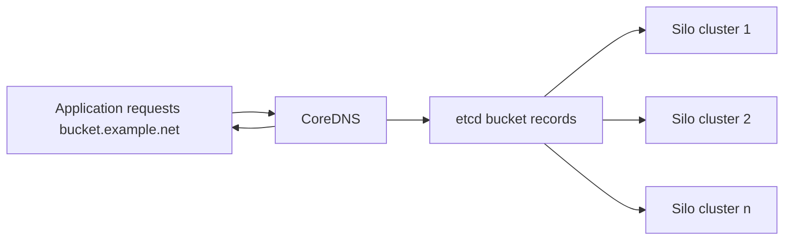

# Federation Quickstart Guide *Federation feature is deprecated and should be avoided for future deployments*

The maintained [federated CopyObject design](https://silo.pgsty.com/blog/design/federated-copy-object/) records the destination encryption, checksum, Object Lock and committed-response contract, including its Server release boundary.

This document explains how to configure Silo with `Bucket lookup from DNS` style federation.

## Cross-deployment copy behavior

Federated `CopyObject` and `UploadPartCopy` forward the write to the destination
deployment. Updated Silo destinations return the modification time of that
committed object or part in `X-Minio-Last-Modified` (UTC RFC 3339 with nanosecond
precision), alongside its ETag and checksums. The proxy uses that write response
to populate the copy result, whose XML retains millisecond precision. This works
for unversioned and versioned objects and encrypted writes, without an additional
HEAD or ListParts request or additional read permissions at the destination.

Both deployments need this change for accurate copy timestamps. If an older
destination omits the header, or an intermediary removes or corrupts it, the copy
still succeeds and retains the historical zero `LastModified` value
(`0001-01-01T00:00:00.000Z`). The proxy neither substitutes its own clock or HTTP
`Date` nor reports a committed write as failed because its timestamp is missing.
The header is a response hint for the existing federation User-Agent token; it
does not grant replication privileges.

A replica-authorized `CopyObject` of a raw SSE-C source across deployments is
unsupported and returns HTTP 501 `NotImplemented` before forwarding any request.
This includes empty objects, which previously succeeded accidentally, and applies
whether or not a copy-source key is supplied. Ordinary federated SSE-C copies
with the source key, local SSE-C key rotation, bucket replication via PUT or
multipart upload, and the separate `UploadPartCopy` operation retain their
existing behavior.

## Get started

### 1. Prerequisites

Install Silo - [Silo Quickstart Guide](https://silo.pgsty.com/operations/deployments/baremetal-deploy-minio-on-redhat-linux/).

### 2. Run Silo in federated mode

Bucket lookup from DNS federation requires two dependencies

- etcd (for bucket DNS service records)
- CoreDNS (for DNS management based on populated bucket DNS service records, optional)

## Architecture



### Environment variables

#### MINIO_ETCD_ENDPOINTS

This is comma separated list of etcd servers that you want to use as the Silo federation back-end. This should
be same across the federated deployment, i.e. all the Silo instances within a federated deployment should use same
etcd back-end.

#### MINIO_DOMAIN

This is the top level domain name used for the federated setup. This domain name should ideally resolve to a load-balancer
running in front of all the federated Silo instances. The domain name is used to create sub domain entries to etcd. For
example, if the domain is set to `domain.com`, the buckets `bucket1`, `bucket2` will be accessible as `bucket1.domain.com`
and `bucket2.domain.com`.

#### MINIO_PUBLIC_IPS

This is comma separated list of IP addresses to which buckets created on this Silo instance will resolve to. For example,
a bucket `bucket1` created on current Silo instance will be accessible as `bucket1.domain.com`, and the DNS entry for
`bucket1.domain.com` will point to IP address set in `MINIO_PUBLIC_IPS`.

- This field is mandatory for standalone and erasure code Silo server deployments, to enable federated mode.
- This field is optional for distributed deployments. If you don't set this field in a federated setup, we use the IP addresses of
hosts passed to the Silo server startup and use them for DNS entries.

### Run Multiple Clusters

> cluster1

```sh
export MINIO_ETCD_ENDPOINTS="http://remote-etcd1:2379,http://remote-etcd2:4001"
export MINIO_DOMAIN=domain.com
export MINIO_PUBLIC_IPS=44.35.2.1,44.35.2.2,44.35.2.3,44.35.2.4
silo server http://rack{1...4}.host{1...4}.domain.com/mnt/export{1...32}
```

> cluster2

```sh
export MINIO_ETCD_ENDPOINTS="http://remote-etcd1:2379,http://remote-etcd2:4001"
export MINIO_DOMAIN=domain.com
export MINIO_PUBLIC_IPS=44.35.1.1,44.35.1.2,44.35.1.3,44.35.1.4
silo server http://rack{5...8}.host{5...8}.domain.com/mnt/export{1...32}
```

In this configuration you can see `MINIO_ETCD_ENDPOINTS` points to the etcd backend which manages Silo's
`config.json` and bucket DNS SRV records. `MINIO_DOMAIN` indicates the domain suffix for the bucket which
will be used to resolve bucket through DNS. For example if you have a bucket such as `mybucket`, the
client can use now `mybucket.domain.com` to directly resolve itself to the right cluster. `MINIO_PUBLIC_IPS`
points to the public IP address where each cluster might be accessible, this is unique for each cluster.

NOTE: `mybucket` only exists on one cluster either `cluster1` or `cluster2` this is random and
is decided by how `domain.com` gets resolved, if there is a round-robin DNS on `domain.com` then
it is randomized which cluster might provision the bucket.

### 3. Test your setup

To test this setup, access the Silo server via browser or [`mc`](https://silo.pgsty.com/reference/minio-mc/#quickstart). You’ll see the uploaded files are accessible from the all the Silo endpoints.

## Explore Further

- [Use `mc` with Silo Server](https://silo.pgsty.com/reference/minio-mc/)
- [Use `aws-cli` with Silo Server](https://silo.pgsty.com/integrations/aws-cli-with-minio/)
- [Use `minio-go` SDK with Silo Server](https://silo.pgsty.com/developers/go/minio-go/)
- [The Silo documentation website](https://silo.pgsty.com/docs/)
